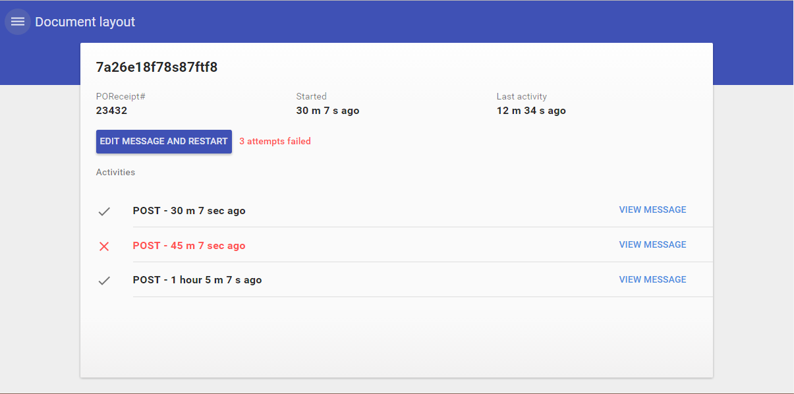
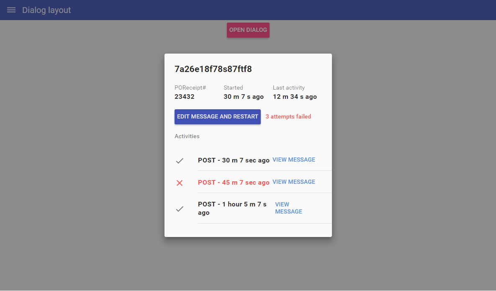

# Pip.WebUI Layouts

Layouts UI components is a sub-module of Pip.Services platform and can be used in applications
based on the platform.

Provided layouts lets cover more widespread design types.

This module provides next functionality:

* Simple/Plain layout
* Single Document layout
* Multi Document layout
* Card layout
* Tiles layout
* Tiles Groups layout
* Dialog layout
* Split View layout

In the version 1.0.0 the implementation was cleaned up and covered with unit tests.
Implementation became fully portable across browser and devices.

[API reference](http://link.com)

### The complete library

* [https://github.com/pip-webui/pip-webui](https://github.com/pip-webui/pip-webui)

## Demos

[Examples Online](http://webui.pipdevs.com/pip-webui-layouts/index.html)


## Quick links

* [Module dependencies](#dependencies)
* [Components](#components)
  - [Single/Plain layout](#simple_layout)
  - [Single Document layout](#single_document_layout)
  - [Multi Document layout](#multi_document_layout)
  - [Card layout](#card_layout)
  - [Tiles layout](#tiles_layout)
  - [Tiles Groups layout](#tiles_groups_layout)
  - [Dialog layout](#dialog_layout)
  - [Split View layout](#split_view_layout)
* [Browsers compatibility](#compatibility)
* [Community](#community)
* [Contributing](#contributing)
* [Build](#build)
* [License](#license)


## <a name="dependencies"></a>Module dependencies

* <a href="https://github.com/pip-webui/pip-webui-tasks">pip-webui-tasks</a> - Helpful tasks for development
* <a href="https://github.com/pip-webui/pip-webui-lib">pip-webui-lib</a> - Vendor libraries
* <a href="https://github.com/pip-webui/pip-webui-css">pip-webui-css</a> - CSS Framework
* <a href="https://github.com/pip-webui/pip-webui-core">pip-webui-core</a> - Core platform module
* <a href="https://github.com/pip-webui/pip-webui-core">pip-webui-nav</a> - All-sufficient UI navigation components


## <a name="components"></a>Module components

### <a name="simple_layout"></a>Simple/Plain layout
<a href="doc/images/img-simple-layout.png" style="border: 3px ridge #c8d2df; display: block">
    
</a>

This layout is flexible and fills on the full available width.

Simple/Plain layout [API reference](http://link.com)

[Online Example](http://webui.pipdevs.com/pip-webui-layouts/simple/index.html)

<br/>

### <a name="single_document_layout"></a>Single document layout
<a href="doc/images/img-single-document-layout.png" style="border: 3px ridge #c8d2df; margin: 0 auto; display: inline-block">
    
</a>

This layout type provides a two states flexible layout. The main container is responsive up to 1200px screen size. After
this breakpoint it has fixed width (1200px) independently of screen size.

Single document layout [API reference](http://link.com)

[Online Example](http://webui.pipdevs.com/pip-webui-layouts/document/index.html)

<br/>

### <a name="multi_document_layout"></a>Multi documents layout
<a href="doc/images/img-multi-document-layout.png" style="border: 3px ridge #c8d2df; margin: 0 auto; display: inline-block">
    
</a>

This layout provides container to perform more than one document into single container. On the left side it performs
navigation. On the right (bigger part) there is located a container for documents.

Component is also responsible up to 1200px. Higher 1200px this component has fixed width and is centered by
horizontally.

Multi document layout [API reference](http://link.com)

[Online Example](http://webui.pipdevs.com/pip-webui-layouts/multi_document/index.html)

<br/>

### <a name="card_layout"></a>Card layout
<a href="doc/images/img-card-layout.png" style="border: 3px ridge #c8d2df; margin: 0 auto; display: inline-block">
    
</a>

This component is provide a block aligned on the middle of wrapper block. One of the use cases is dialog panels.
On the mobile screens (less than 768px) content is stretch out the whole available width.

Card layout [API reference](http://link.com)

[Online Example](http://webui.pipdevs.com/pip-webui-layouts/card/index.html)

<br/>

### <a name="tiles_layout"></a>Tiles layout
<a href="doc/images/img-tiles-layout.png" style="border: 3px ridge #c8d2df; margin: 0 auto; display: inline-block">
    
</a>

Renders tiles in specified arrange (such passed via directive attributes). Tiles are filled one by one to fill all
available space optimal. Tiles have fixed width. Height is specified into entity item.

Tiles layout [API reference](http://link.com)

[Online Example](http://webui.pipdevs.com/pip-webui-layouts/tiles/index.html)

<br/>

### <a name="tiles_groups_layout"></a>Tiles Groups layout
<a href="doc/images/img-tiles-groups-layout.png" style="border: 3px ridge #c8d2df; margin: 0 auto; display: inline-block">
    
</a>

This component provides several tiles layout are separated into groups.


Tiles Groups layout [API reference](http://link.com)

[Online Example](http://webui.pipdevs.com/pip-webui-layouts/tile_groups/index.html)

<br/>

### <a name="dialog_layout"></a>Dialog layout
<a href="doc/images/img-dialog-layout.png" style="border: 3px ridge #c8d2df; margin: 0 auto; display: inline-block">
    
</a>

Dialog layout has the similar behaviour as card layout. But it is located over another content and show semi-transparent
 backdrop.

Dialog layout [API reference](http://link.com)

[Online Example](http://webui.pipdevs.com/pip-webui-layouts/dialog/index.html)

<br/>

### <a name="split_view_layout"></a>Split View layout
<a href="doc/images/img-split-view-layout.png" style="border: 3px ridge #c8d2df; margin: 0 auto; display: inline-block">
    
</a>

This layout is contains two content sections. Each sections has half of full block width. In the left panel there is located higher
level content. In the right panel there is located nested content (related to higher level one).

Size of the component is flexible. It is responsive up to 1200px. And it has fixed width on screens more than 1200px.

Split View layout [API reference](http://link.com)

[Online Example](http://webui.pipdevs.com/pip-webui-layouts/split/index.html)


## <a name="compatibility"></a>Compatibility

PIP.WEBUI has been thoroughly tested against all major browsers and supports:

 * IE11+,
 * Edge
 * Chrome 47+,
 * Firefox 43
 * Opera 35

## <a name="community"></a>Community

* Follow [@pip.webui on Twitter](http://link.com)
* Subscribe to the [PIP.WebUI Newsletter](http://link.com)
* Have a question that's not a feature request or bug report? Discuss on the [PIP Forum](https://groups.google.com/forum/#!forum/pipdevs)
* Have a feature request or find a bug? [Submit an issue](http://link.com)
* Join our Community Slack Group! [PIP Worldwide](http://link.com)


## <a name="contributing"></a>Contributing

Developers interested in contributing should read the following guidelines:

* [Issue Guidelines](http://somelink.com)
* [Contributing Guidelines](http://somelink.com)
* [Coding guidelines](http://somelink.com)

> Please do **not** ask general questions in an issue. Issues are only to report bugs, request
  enhancements, or request new features. For general questions and discussions, use the
  [Pip Devs Forum](https://groups.google.com/forum/#!forum/pipdevs).

It is important to note that for each release, the [ChangeLog](CHANGELOG.md) is a resource that will
itemize all:

- Bug Fixes
- New Features
- Breaking Changes

## <a name="build"></a>Build

Projects environment deploy is occurred using npm and gulp.

First install or update your local project's **npm** tools:

```bash
# First install all the NPM tools:
npm install

# Or update
npm update
```

Then run the **gulp** tasks:

```bash
# To clean '/build' and '/dist' directories
gulp clean

# To build distribution files in the `/dist` directory
gulp build

# To launch samples (build will open samples/index page in web browser)
gulp launch
```

For more details on how the build process works and additional commands (available for testing and
debugging) developers should read the [Build Instructions](docs/guides/BUILD.md).


## <a name="license"></a>License

PIP.WebUI is under [MIT licensed](LICENSE).

