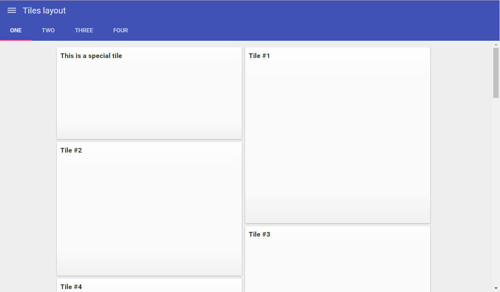
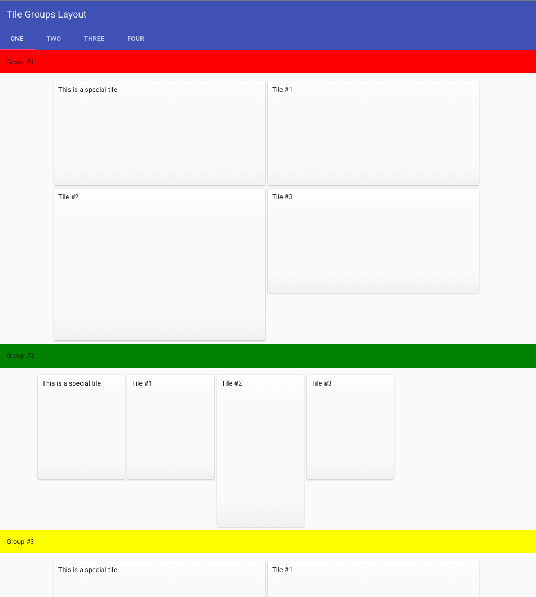

#    Responsive content layouts

Development responsible applications requires to organization content the way that can fit available screen from small phones to large desktops. In Line-of-Business applications with tens screens and dialogs implementaing responsive layouts can be time consuming and error prone task. To make it more productive Pip.WebUI.Layouts module provides a set of universal responsible layouts that can help to organize content in number of different ways: as full-screen content, documents, tiles, dialogs and more.

### Simple/Plain layout

This layout is flexible and fills on the full available width.

Simple/Plain layout [API reference](http://link.com)

[Online Example](http://webui.pipdevs.com/pip-webui-layouts/simple/index.html)

 

### Single document layout

This layout type provides a two states flexible layout. The main container is responsive up to 1200px screen size. After
this breakpoint it has fixed width (1200px) independently of screen size.

Single document layout [API reference](http://link.com)

[Online Example](http://webui.pipdevs.com/pip-webui-layouts/document/index.html)

 

### Multi documents layout

This layout provides container to perform more than one document into single container. On the left side it performs
navigation. On the right (bigger part) there is located a container for documents.

Component is also responsible up to 1200px. Higher 1200px this component has fixed width and is centered by
horizontally.

Multi document layout [API reference](http://link.com)

[Online Example](http://webui.pipdevs.com/pip-webui-layouts/multi_document/index.html)

 

### Card layout

This component is provide a block aligned on the middle of wrapper block. One of the use cases is dialog panels.
On the mobile screens (less than 768px) content is stretch out the whole available width.

Card layout [API reference](http://link.com)

[Online Example](http://webui.pipdevs.com/pip-webui-layouts/card/index.html)

 

### Tiles layout

Renders tiles in specified arrange (such passed via directive attributes). Tiles are filled one by one to fill all
available space optimal. Tiles have fixed width. Height is specified into entity item.

Tiles layout [API reference](http://link.com)

[Online Example](http://webui.pipdevs.com/pip-webui-layouts/tiles/index.html)

 

### Tiles Groups layout

This component provides several tiles layout are separated into groups.

Tiles Groups layout [API reference](http://link.com)

[Online Example](http://webui.pipdevs.com/pip-webui-layouts/tile_groups/index.html)

 

### Dialog layout

Dialog layout has the similar behaviour as card layout. But it is located over another content and show semi-transparent
 backdrop.

Dialog layout [API reference](http://link.com)

[Online Example](http://webui.pipdevs.com/pip-webui-layouts/dialog/index.html)

 

### Split View layout

This layout is contains two content sections. Each sections has half of full block width. In the left panel there is located higher
level content. In the right panel there is located nested content (related to higher level one).

Size of the component is flexible. It is responsive up to 1200px. And it has fixed width on screens more than 1200px.

Split View layout [API reference](http://link.com)

[Online Example](http://webui.pipdevs.com/pip-webui-layouts/split/index.html)

## Learn more about the module

- [User's guide](doc/UsersGuide.md)
- [Online samples](http://webui.pipdevs.com/pip-webui-layouts/index.html)
- [API reference](http://webui-api.pipdevs.com/pip-webui-layouts/index.html)
- [Developer's guide](doc/DevelopersGuide.md)
- [Changelog](CHANGELOG.md)
- [Pip.WebUI project website](http://www.pipwebui.org)
- [Pip.WebUI project wiki](https://github.com/pip-webui/pip-webui/wiki)
- [Pip.WebUI discussion forum](https://groups.google.com/forum/#!forum/pip-webui)
- [Pip.WebUI team blog](https://pip-webui.blogspot.com/)

## Module dependencies

* [pip-webui-lib](https://github.com/pip-webui/pip-webui-lib): angular, angular material and other 3rd party libraries
* [pip-webui-css](https://github.com/pip-webui/pip-webui-css): CSS styles and web components
* [pip-webui-core](https://github.com/pip-webui/pip-webui-core): core services
* [pip-webui-layouts](https://github.com/pip-webui/pip-webui-layouts): document layout

## License

This module is released under [MIT license](License) and totally free for commercial and non-commercial use.
