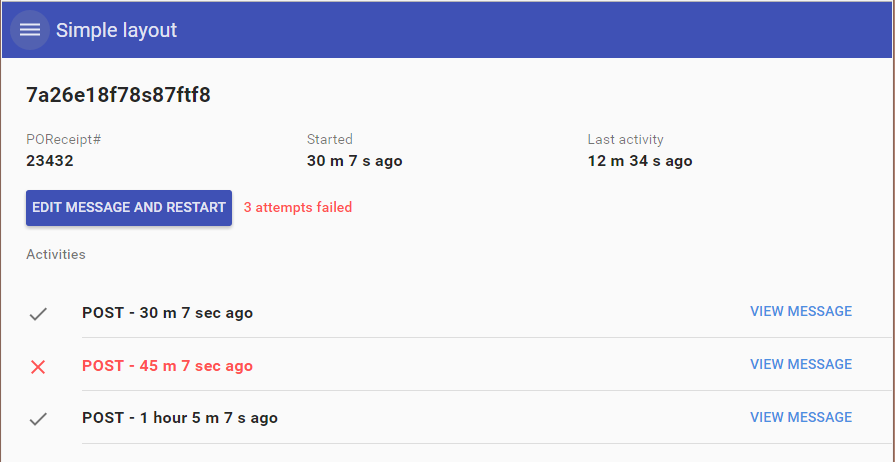
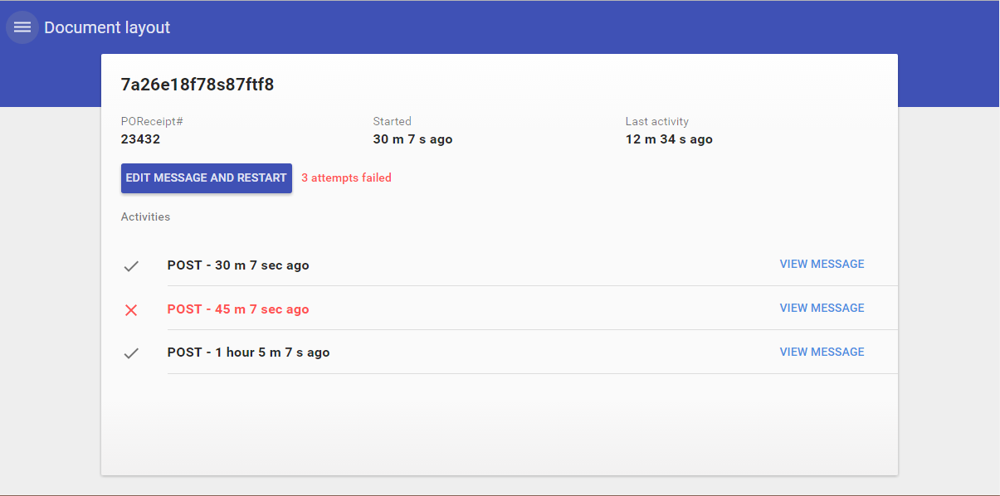
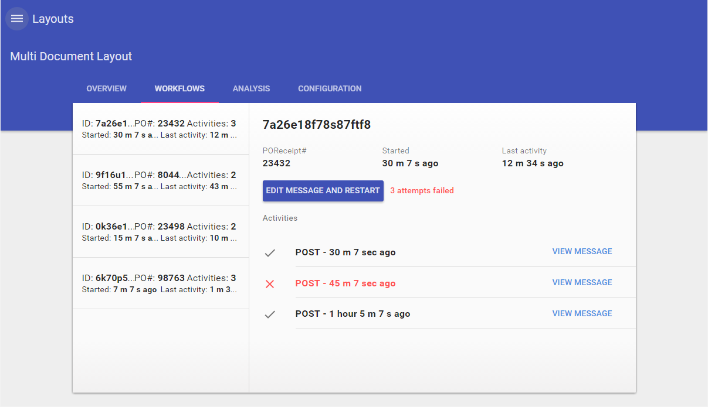
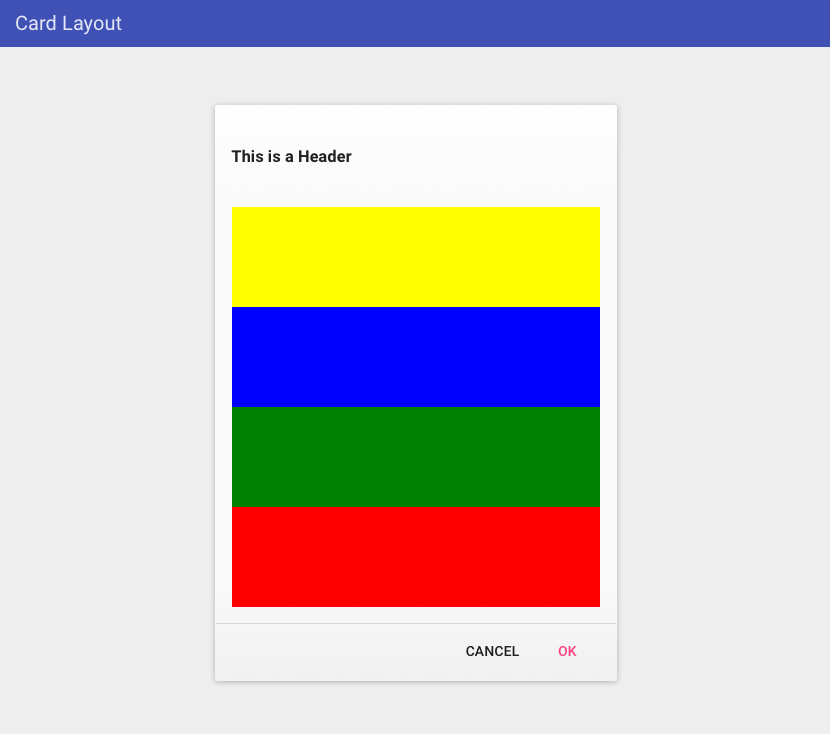
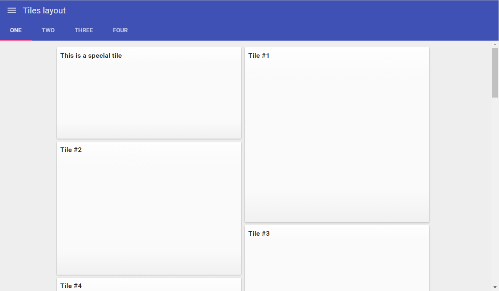
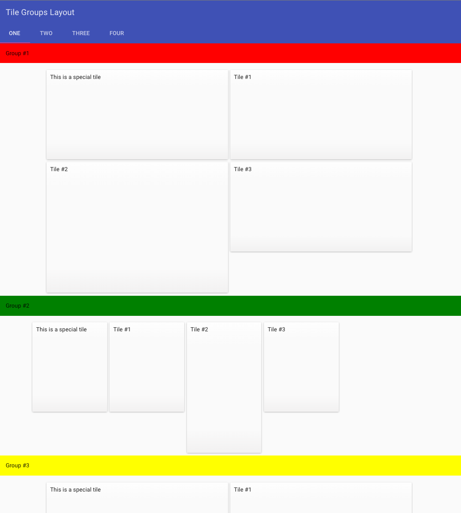
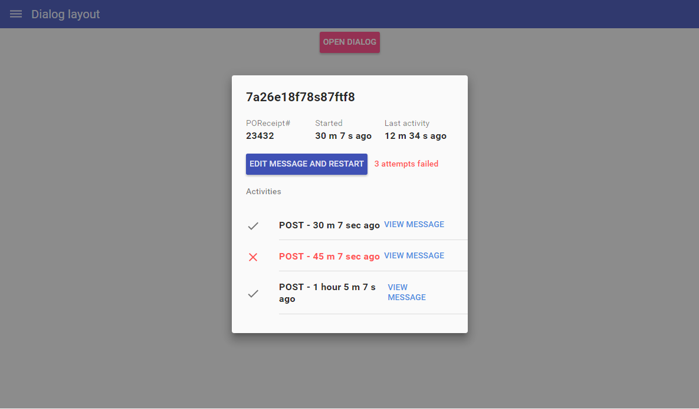
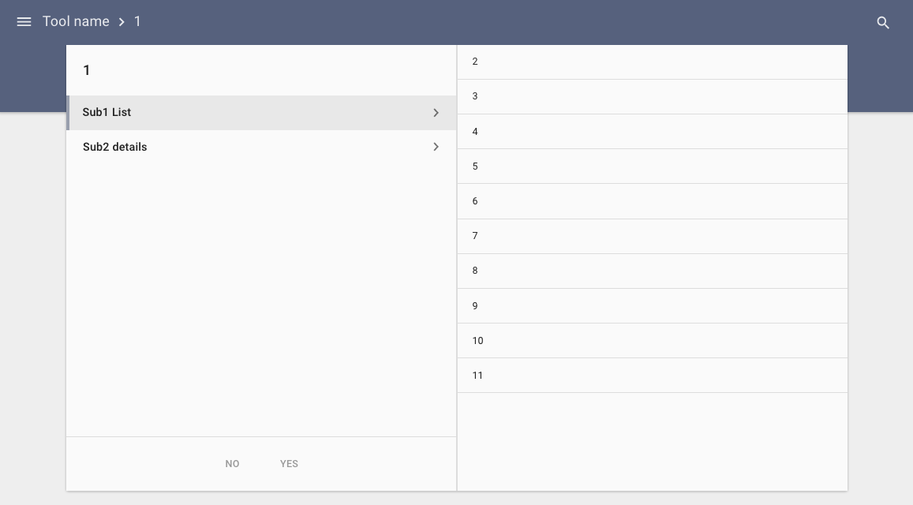

# Pip.WebUI.Layouts User's Guide

## <a name="contents"></a> Contents
- [Installing](#install)
- [pip-main directive](#main)
- [pip-main-body directive](#main_body)
- [pip-simple directive](#simple)
- [pip-document directive](#document)
- [pip-card directive](#card)
- [pip-tiles directive](#tiles)
- [pip-dialog directive](#dialog)
- [pipSplit service](#split_service)
- [Questions and bugs](#issues)


## <a name="install"></a> Installing

Add dependency to **pip-webui** into your **bower.json** or **package.json** file depending what you use.
```javascript
"dependencies": {
  ...
  "pip-webui": "*"
  ...
}
```

Alternatively you can install **pip-webui** manually using **bower**:
```bash
bower install pip-webui
```

or install it using **npm**:
```bash
npm install pip-webui
```

Include **pip-webui** files into your web application.
```html
<link rel="stylesheet" href=".../pip-webui-lib.min.css"/>
...
<script src=".../pip-webui-lib.min.js"></script>
<script src=".../pip-webui-test.min.js"></script>
```

Register **pipLayouts** module in angular module dependencies.
```javascript
angular.module('myApp',[..., 'pipLayouts']);
```


## <a name="main"></a> pip-main directive

**pip-main** directive shall be placed at the top of DOM hierarchy right below **body** tag. It serves as container for entire application content and broadcasts **pipWindowResize** event every time when application window is resized to adjust content.

## Usage
```html
<body>
  <pip-main>
    <pip-appbar>...</pip-appbar>
    <pip-main-body>
       ...
    </pip-main-body>
  </pip-main-body>
</body>
```


## <a name="main_body"></a> pip-main-body directive

**pip-main-body** directive designate the center part of the screen where content is placed excluding appbar, footer and sidebars. All layouts shall be placed under **pip-main-body**

## Usage
```html
<body>
  <pip-main>
    <pip-appbar>...</pip-appbar>
    <pip-main-body>
       ...
    </pip-main-body>
  </pip-main-body>
</body>
```


## <a name="simple"></a> pip-simple directive

**pip-simple** directive resizes content to the entire screen, full width and full height.

### Usage
Todo: Add HTML snippet to demonstrate the directive with all attributes



See online sample [here...](http://webui.pipdevs.com/pip-webui-layouts/simple/index.html)


## <a name="document"></a> pip-document directive

**pip-document** places content as a document with fixed width and full height centered on the screen. On tables and phones the content occupies the whole screen. Using additional classes the directive can be extended to old multi-document (master-detail) layout.

### Usage
Todo: Add HTML snippet to demonstrate the directive with all attributes



See online sample [here...](http://webui.pipdevs.com/pip-webui-layouts/document/index.html)



See online sample [here...](http://webui.pipdevs.com/pip-webui-layouts/multi_document/index.html)

### Attributes
Todo: Describe all attributes in this directive

### Classes
Todo: Describe additional classes used for this layout


## <a name="card"></a> pip-card directive

**pip-card** directive places small content at the center of the screen in a card. On phones the content is extended to the whole screen.

### Usage
Todo: Add HTML snippet to demonstrate the directive with all attributes



See online sample [here...](http://webui.pipdevs.com/pip-webui-layouts/card/index.html)

### Attributes
Todo: Describe all attributes in this directive

### Classes
Todo: Describe additional classes used for this layout


## <a name="tiles"></a> pip-tiles directive

**pip-tiles** directive is used to present multiple items in tiles that arranged on the screen in one or several columns.
Using additional classes this directive can be modified to show tile groups (see below).

### Usage
Todo: Add HTML snippet to demonstrate the directive with all attributes



See online sample [here...](http://webui.pipdevs.com/pip-webui-layouts/tiles/index.html)



See online sample [here...](http://webui.pipdevs.com/pip-webui-layouts/tile_groups/index.html)

### Attributes
Todo: Describe all attributes in this directive

### Classes
Todo: Describe additional classes used for this layout


## <a name="dialog"></a> pip-dialog directive

**pip-dialog** directive places content in a modal dialog. On phones the dialog is resized to occupy the entire screen.

### Usage
Todo: Add HTML snippet to demonstrate the directive with all attributes



See online sample [here...](http://webui.pipdevs.com/pip-webui-layouts/dialog/index.html)

### Attributes
Todo: Describe all attributes in this directive

### Classes
Todo: Describe additional classes used for this layout


## <a name="split_service"></a> pipSplit service

**pipSplitService** helps to create split layout. That layout can be helpful to organize complex hierarchical content. As user drills down the content, it slides to the right. Going to the top of the hierarchy slides the content to the left. To simplify navigation this content integrates with breadcrumb in **Appbar**

### Usage
Todo: Add code snipper that shows calls to pipSplit service



See online sample [here...](http://webui.pipdevs.com/pip-webui-layouts/split/index.html)

### Methods
Todo: Descript pipSplit service methods here


## <a name="issues"></a> Questions and bugs

If you have any questions regarding the module, you can ask them using our 
[discussion forum](https://groups.google.com/forum/#!forum/pip-webui).

Bugs related to this module can be reported using [github issues](https://github.com/pip-webui/pip-webui-layouts/issues).
