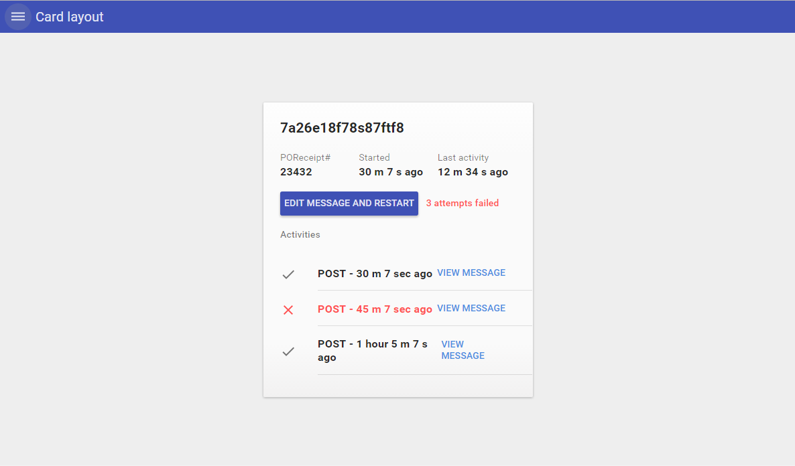

# Pip.WebUI.Layouts User's Guide

## <a name="contents"></a> Contents
- [Installing](#install)
- [pip-main directive](#main)
- [pip-main-body directive](#main_body)
- [pip-simple directive](#simple)
- [pip-document directive](#document)
- [pip-card directive](#card)
- [pip-tiles directive](#tiles)
- [pip-dialog directive](#dialog)
- [pipSplit service](#split_service)
- [Questions and bugs](#issues)


## <a name="install"></a> Installing

Add dependency to **pip-webui** into your **bower.json** or **package.json** file depending what you use.
```javascript
"dependencies": {
  ...
  "pip-webui": "*"
  ...
}
```

Alternatively you can install **pip-webui** manually using **bower**:
```bash
bower install pip-webui
```

or install it using **npm**:
```bash
npm install pip-webui
```

Include **pip-webui** files into your web application.
```html
<link rel="stylesheet" href=".../pip-webui-lib.min.css"/>
<link rel="stylesheet" href=".../pip-webui.min.css"/>
...
<script src=".../pip-webui-lib.min.js"></script>
<script src=".../pip-webui.min.js"></script>
```

Register **pipLayouts** module in angular module dependencies.
```javascript
angular.module('myApp',[..., 'pipLayouts']);
```


## <a name="main"></a> pip-main directive

**pip-main** directive shall be placed at the top of DOM hierarchy right below **body** tag. It serves as container for entire application content and broadcasts **pipWindowResize** event every time when application window is resized to adjust content.

## Usage
```html
<body>
  <pip-main>
    <pip-appbar>...</pip-appbar>
    <pip-main-body>
       ...
    </pip-main-body>
  </pip-main-body>
</body>
```


## <a name="main_body"></a> pip-main-body directive

**pip-main-body** directive designate the center part of the screen where content is placed excluding appbar, footer and sidebars. All layouts shall be placed under **pip-main-body**

## Usage
```html
<body>
  <pip-main>
    <pip-appbar>...</pip-appbar>
    <pip-main-body>
       ...
    </pip-main-body>
  </pip-main-body>
</body>
```


## <a name="simple"></a> pip-simple directive

**pip-simple** directive resizes content to the entire screen, full width and full height.

### Usage
```html
<pip-main-body>
    <pip-simple>
        ...
    </pip-simple>
</pip-main-body>
```


See online sample [here...](http://webui.pipdevs.com/pip-webui-layouts/simple/index.html)

## <a name="document"></a> pip-document directive

**pip-document** places content as a document with fixed width and full height centered on the screen. On tables and phones the content occupies the whole screen. Using additional classes the directive can be extended to old multi-document (master-detail) layout.

### Usage
```html
<pip-main-body>
    <div class="pip-document-container">
        <md-toolbar class="pip-appbar-ext">
        </md-toolbar>
        
        <pip-document>
            ...
        </pip-document>
    </div>         
</pip-main-body>
```


See online sample [here...](http://webui.pipdevs.com/pip-webui-layouts/document/index.html)


See online sample [here...](http://webui.pipdevs.com/pip-webui-layouts/multi_document/index.html)

### Classes
* **pip-document** - main class of layout, it contains all the basic styles

## <a name="card"></a> pip-card directive

**pip-card** directive places small content at the center of the screen in a card. On phones the content is extended to the whole screen.

### Usage
```html
<pip-main-body>

    <div class="pip-card-container pip-outer-scroll">
        <pip-card width="400" height="400" min-width="400" min-height="400">
            <div class="pip-header">...</div>
            
            <div class="pip-body">...</div>
            
            <div class="pip-footer">...</div>
        </pip-card>
    </div>

</pip-main-body>
```



See online sample [here...](http://webui.pipdevs.com/pip-webui-layouts/card/index.html)

### Attributes
* **width** - set width of card
* **height** - set height of card
* **min-width** - set minimum width of card
* **min-height** - set minimum height of card

### Classes
* **pip-card** - main class of layout, it contains all the basic styles
* **pip-card-container** - class for container, which contains card
* **pip-outer-scroll** - set scroll to card container, remove scroll from card. By default card has scroll, card container hasn't.
* **pip-header** - class, which located in card, it contains titles of card
* **pip-body** - class, which located in card, it contains main part of card
* **pip-footer** - class, which located in card, it contains action buttons of card

## <a name="tiles"></a> pip-tiles directive

**pip-tiles** directive is used to present multiple items in tiles that arranged on the screen in one or several columns.
Using additional classes this directive can be modified to show tile groups (see below).

### Usage
```html
<pip-tiles column-width="440">
    <div class="masonry-brick pip-tile">
        ...
    </div>
</pip-tiles>
```


See online sample [here...](http://webui.pipdevs.com/pip-webui-layouts/tiles/index.html)


See online sample [here...](http://webui.pipdevs.com/pip-webui-layouts/tile_groups/index.html)

### Attributes
* **column-width** - width of column, which contains tiles, count of column calculated according to the width of window
* **pip-infinite** - set on infinite scroll for tiles container

### Classes
* **pip-tiles-container** - class, which contains tiles
* **pip-tile** - main class, it contains all the basic styles for tile
* **masonry-brick** - means that this dom-element involved in the construction of tiles list

## <a name="dialog"></a> pip-dialog directive

**pip-dialog** directive places content in a modal dialog. On phones the dialog is resized to occupy the entire screen.

### Usage
```html
<md-dialog class="pip-dialog" width="600" height="800" min-width="600" min-height="800">
    <div class="pip-header">
        ...
    </div>
    <div class="pip-body">
        ...
    </div>
    <div class="pip-footer">
        ...
    </div>
</md-dialog>
```


See online sample [here...](http://webui.pipdevs.com/pip-webui-layouts/dialog/index.html)

### Attributes
* **width** - width of dialog window
* **height** - height of dialog window
* **min-width** - minimum width of dialog window
* **min-width** - minimum width of dialog window

### Classes
* **pip-dialog** - main class of layout, it contains all basic styles
* **pip-header** - class, which located in dialog, it contains titles of card
* **pip-body** - class, which located in dialog, it contains main part of card
* **pip-footer** - class, which located in dialog, it contains action buttons of card

## <a name="split_service"></a> pipSplit service

**pipSplitService** helps to create split layout. That layout can be helpful to organize complex hierarchical content. As user drills down the content, it slides to the right. Going to the top of the hierarchy slides the content to the left. To simplify navigation this content integrates with breadcrumb in **Appbar**

### Usage
```html
<pip-document class="pip-split pip-no-border"
              md-swipe-right="onSwipeRight()" md-swipe-left="onSwipeLeft()">

    <div class="pip-menu-container pip-border-no-top">
        ...
    </div>
</pip-document>
```


See online sample [here...](http://webui.pipdevs.com/pip-webui-layouts/split/index.html)

### Methods
* **addTransitionSequence** - creates order states to animate pages
* **forwardTransition** - returns the direction of animation

## <a name="issues"></a> Questions and bugs

If you have any questions regarding the module, you can ask them using our 
[discussion forum](https://groups.google.com/forum/#!forum/pip-webui).

Bugs related to this module can be reported using [github issues](https://github.com/pip-webui/pip-webui-layouts/issues).
